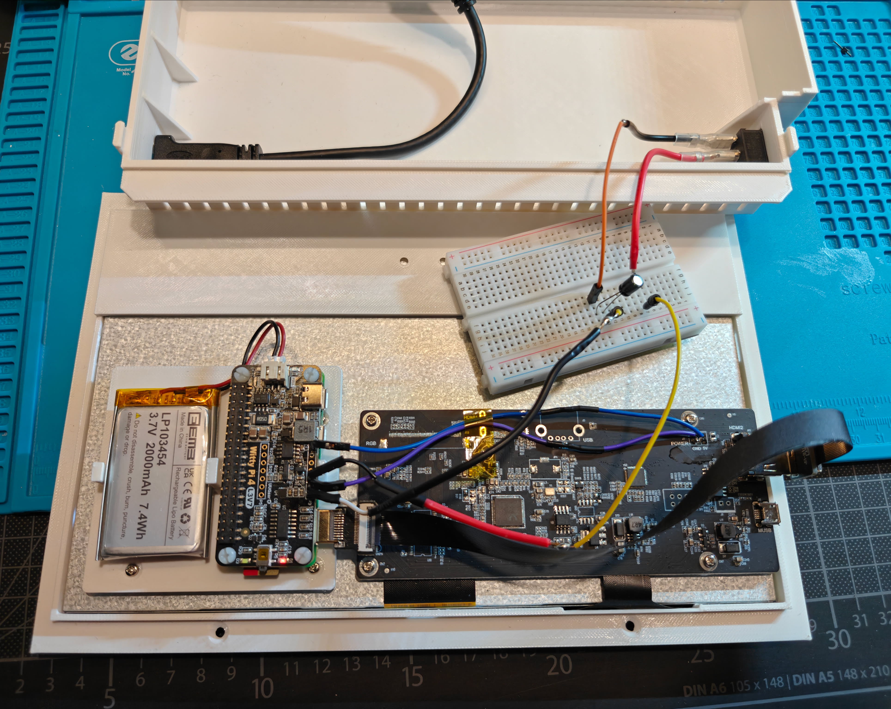
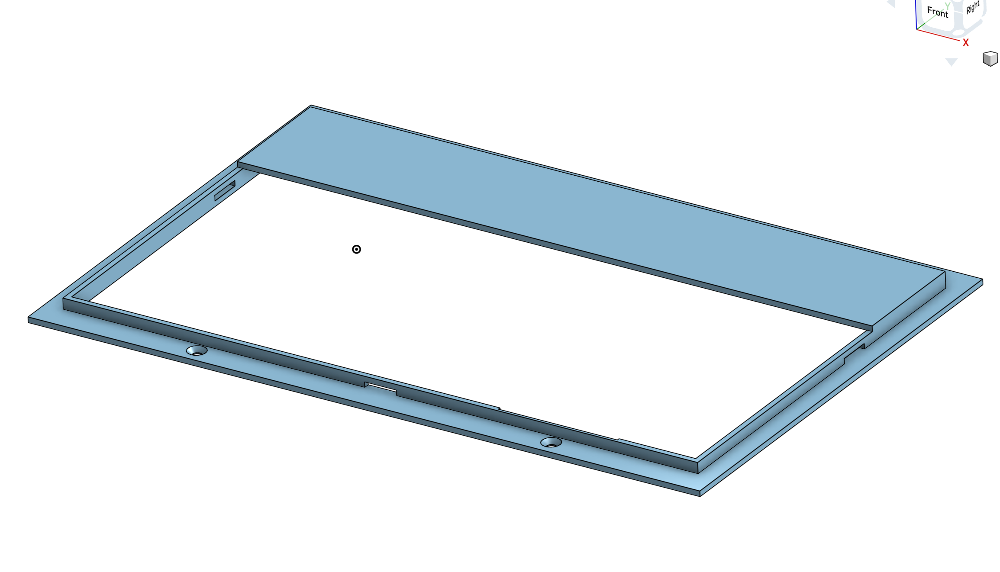
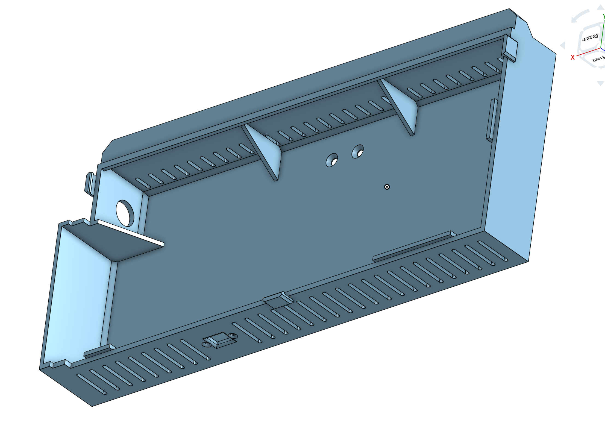
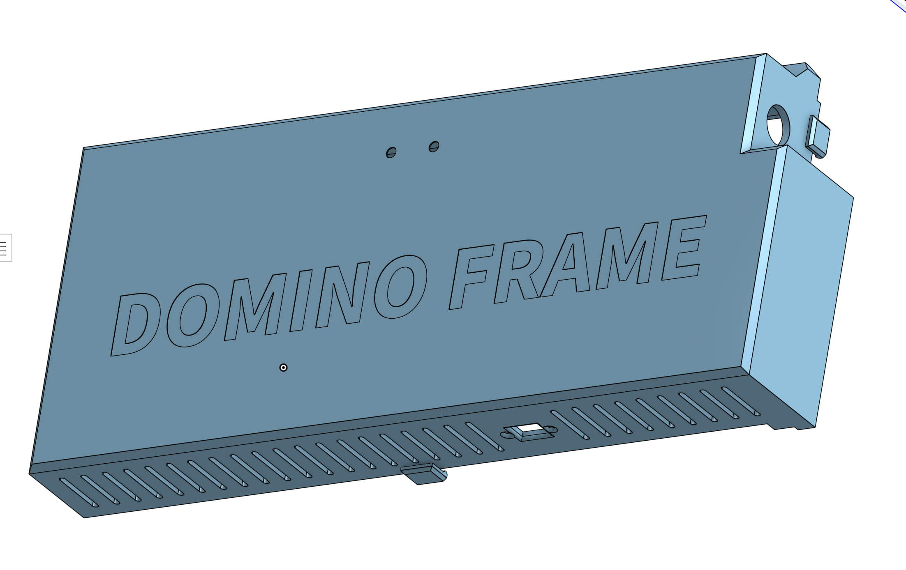
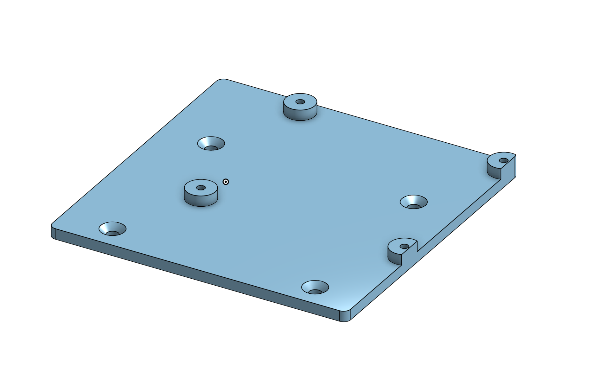
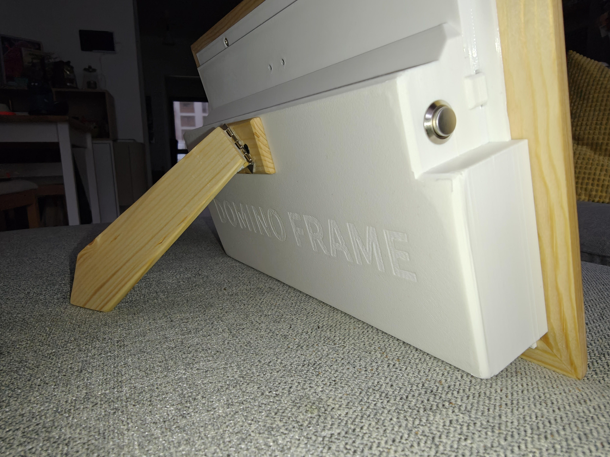
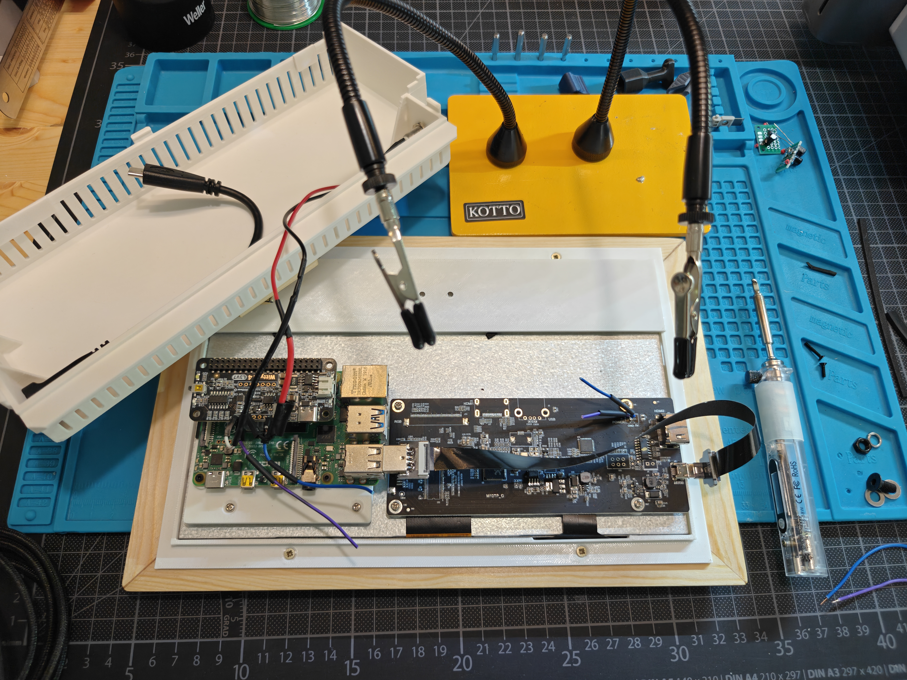
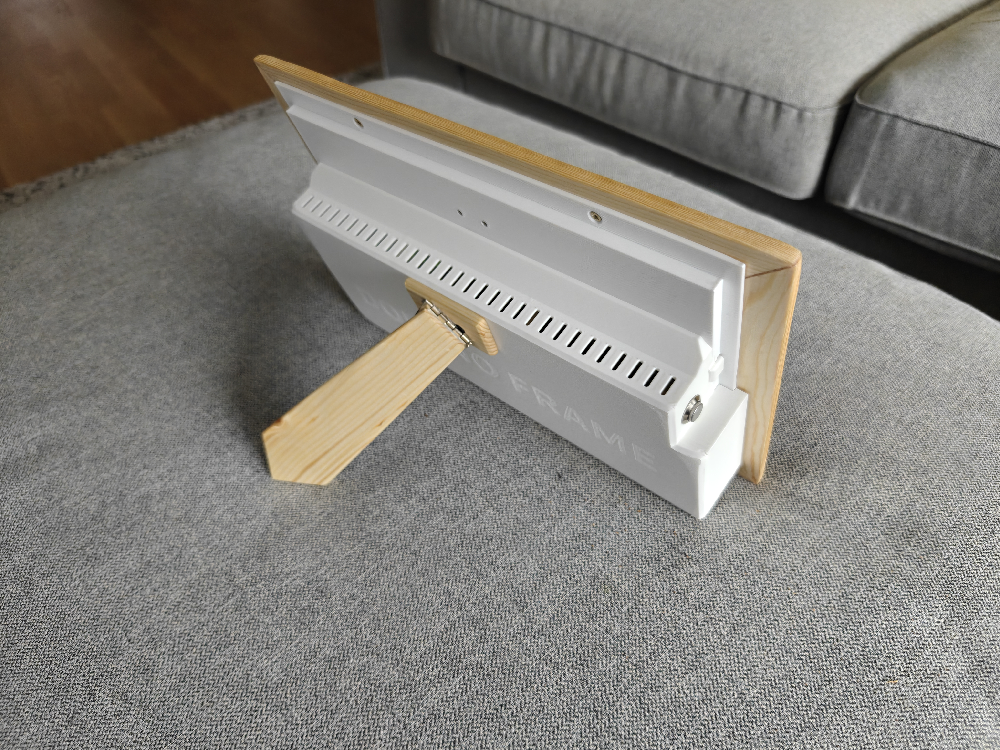
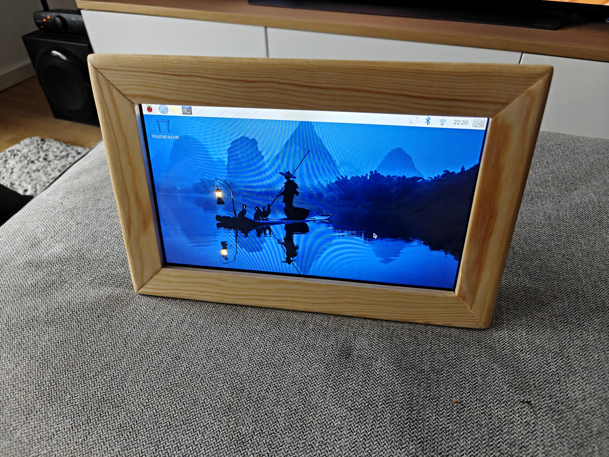

In my quest to get better with electronics and hardware projects, I recently decided I wanted to build my own "digital picture frame" project as gifts for my grandparents. I know these things can be bought pretty cheaply, but who knows where your family is uploading their photos to and who has access to the hardware in the picture frames. Plus it seemed like a perfectly scoped project to handle myself over the course of a few weekends and evenings.

Going into this I was pretty confident in my ability to build the software part of this project as it was pretty straightforward and simple. I knew I needed some storage for the photos, a web app to manage the displays as well as give family members access to manage media, and ideally good mobile support including PWA-like "install" capability so they can put the web app on their home screen without having to build a whole Android/iOS application. Boy did that turn out to not be as simple as I had pictured of course 😅 More details below.

The part I was less confident in, and where I was looking forward to learning more, was the hardware aspect of this project. I wanted to build a custom picture frame, a classic beginner woodworking project, to house an LCD display. I knew that I would need to design and 3D print a housing for the electronics that would mount to the back of the display. And I had planned to keep this low-power enough to run off of a battery.

## Goals

So let's put those down as concrete goals and see how we did, or did not, achieve them.

- Build software system for managed picture frame
  - S3 Bucket for storing photos
  - Web application for:
    - Managing frame deployments
    - Managing media (create, read, edit, delete, etc.)
- Build custom picture frame hardware
- Design and 3D print housing for electronics
- Assemble custom picture frame with LCD display
- Select components and assemble electronics
- Build "firmware" to query images and run a slideshow on the display

## Shopping

I began by shopping around for electronics components that I would need. I wanted this thing to be low powered enough to run at least 1 day on a decently sized LiPo battery, not too big to be impossible to ship and/or take on a plane. I sourced a few key components, including a Raspberry Pi Zero 2 W for its low power consumption and small form factor, a 7-inch HDMI touchscreen display, and a Witty Pi Mini RTC board to handle power management and real-time clock functionality. I also picked up a suitable LiPo battery to ensure the system could run independently of a constant power source.

Below is a light bill of materials (also known as a BOM in the electronics world):

- Raspberry Pi Zero 2 W
- LiPo battery (3.7V, 2000mAh)
  - Just happened to be what I had on hand
- 1024x600 HDMI touchscreen display
- Witty Pi Mini RTC and power-management board
  - Specifically the "Witty Pi L3V7", which now looks to be deprecated in favor of the "Witty Pi Mini"
- MicroSD card
- 5V power supply appropriate for the Pi, display, and Witty Pi
- Normally open toggle switch to power on/off

## Case

After doing some shopping and getting all my components in, I began by designing and modelling the case, which would be 3D printed. It consisted of 3 parts:

1. The initial mounting bracket that screwed into the wooden frame and served two purposes. First, it clamped the screen into the inset lip, also known as a rabbet, that I'd cut into the back of the picture frame. Second, it provided mounting options to clip in the rest of the electronics housing.

2. Next was the primary housing which contained all of the electronics and gave this a bit of a professional product feel in my opinion. There are ventilation holes as well as a bit of branding inset into the back ("DOMINO FRAME"). In addition, there are cut-outs for a USB-C power cable in the bottom and that aforementioned switch in the left side of the housing.

3. Finally, a small bracket that would screw into the factory mounting holes on the backside of the LCD. This would provide electrical isolation between the bottom of the Pi and the back of the LCD's aluminum housing, as well as 4 convenient plastic stand-offs to mount the Pi onto.

Below you can see a dry-fit testing of the assembly of the case parts before final assembly:

## Electronics

Eagle-eyed readers may have noticed references to two different Raspberry Pis. Unfortunately it turned out that the Raspberry Pi Zero 2W was just not powerful enough. In hindsight this was almost certainly due to my inefficient "firmware" application I had written to query an S3 bucket and run a slideshow on the screen. So I switched to a Raspberry Pi 4 Model B, which handled the decoding and UI rendering much more smoothly.

Here's a look at how the Raspberry Pi 4B+ mounting and electronics panel turned out.

I've referenced "firmware" in quotes a few times so far, as my software played the classic role of firmware if this were an embedded project. But for simplicity's sake, I opted to just run the standard Raspberry Pi OS and write the auto-started application in Go, as it had some lightweight UI libraries available for native desktop applications on Linux. The Go application itself turned out to be quite lightweight, leveraging the `fyne` toolkit for the GUI and `minio-go` for interacting with the S3-compatible storage backend. Caveat: I'm far from a Go expert, so this was written with significant help from Claude Code and co.

## Power scheduling with Witty Pi

I wanted the frame to behave like an appliance. It should turn on in the morning, run during the day, then shut itself down at night without depending on the operating system staying awake.

This is where the Witty Pi L3V7 comes in. Its RTC and power controller cut power to the Pi after a clean shutdown, then wake it again at the next scheduled time.

The current schedule is:

- Power on at 08:00
- Power off at 20:15

That keeps the Pi on for 12 hours and 15 minutes, then off for 11 hours and 45 minutes. This legitimately helps reduce overall power usage with the bonus side-effect of calming the nerves of grandparents who are used to chasing us about leaving the lights on.

## Software

### Client Software

The frame application is a small Go program that runs full-screen on the Pi. It pulls photos from a Cloudflare R2 bucket defined via env vars in the systemd service configuration and presents them as a slideshow. Each image gets a slow Ken Burns-style movement, with a small zoom and alternating diagonal drift, so the display does not feel completely static.

The screen is touch-enabled, but I did not want visible controls covering the images. Therefore I added transparent "buttons" that covered the entire left and right edges and turned them into tap zones for moving through the slideshow.

The "firmware" is open source and can be found [here](https://github.com/ndom91/domino-frame).

### Web Application

The web application is a simple Next.js application hosted on Vercel. It provides the following functionality:

- Onboarding new frames
- Manage existing frames (rename, reboot, etc.)
- Manage the media library of each frame

My target audience was my family members who would overwhelmingly be using this application from their phones. I'm significantly more experienced building and maintaining web applications as opposed to mobile apps, so I designed this to be responsive and work well from mobile. I also included a PWA-style `manifest.json` which allowed it to be "installed" to users' home screens on iOS and Android. By not including a service worker, we skip a lot of the typical caching and service worker complexities, but retain the PWA-style installability.

All of the CRUD functionality around managing Frames and their media is really standard and was easy enough to implement. However, I really wanted a grade-A on-boarding experience for new frames (even though realistically there will only ever be 2-3 of these devices out in the wild max and I will be the one setting them up haha).

> [!NOTE]
> Many devices in the HomeAssistant ecosystem including ESPHome, Matter, etc. use something called [Improv](https://www.improv-wifi.com) to manage onboarding a new device onto your WiFi. The target IoT device surfaces a BLE GATT endpoint and because browsers now support a Bluetooth API, you can simply send init data (like target WiFi credentials) via BLE to the IoT device. This is generally a great experience and I wanted to emulate it.

The plan was that when a device initially fires up the Go application and does not have a configuration file set up, it advertises a BLE GATT service characteristic that allows WiFi credentials to be sent via BLE. Once the device receives these credentials, it connects to the WiFi network, begins pulling the photo files destined for its `deviceId`, and polls for updates.

I knew browsers should have Web Bluetooth support and that doing this local BLE onboarding experience should work out of the browser, but getting this to fully work was the most complicated and head-scratching part of the whole project. First of all, support for this API is spotty among browsers, especially the BLE GATT part. Second, the common Linux Bluetooth stack package is super out of date on the Raspberry Pi OS repo, so I had to manually compile the latest version of BlueZ a few times. I should have just skipped this by creating the DB entry manually for every new frame and writing out its config file by hand whenever a new set of family members gets one of these 😂

You can find the Next.js application on GitHub [here](https://github.com/ndom91/domino-frame-web).

## Summary

I'm very happy with where we landed. The frames look like actual picture frames from the front, while the back has just enough custom hardware to make the project feel like a small product instead of a Pi taped to a display.

The project ended up being just the right amount of challenging and rewarding. The first Pi was underpowered, Bluetooth onboarding was much more work than it had any right to be, and fitting the electronics cleanly into the frame took several rounds of CAD and test prints. None of that was particularly surprising in hindsight, but it was very satisfying to work through it.

There are still things I would change if I made another batch, of course, but these are now out in the world showing family photos, turning themselves on in the morning, and going to sleep at night.

Here are a few more photos of the finished frames.

